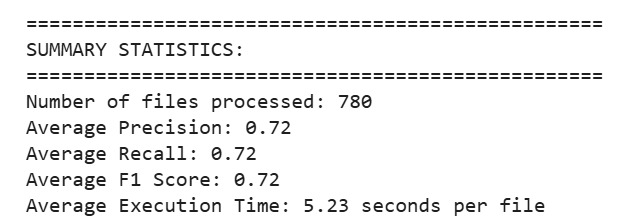
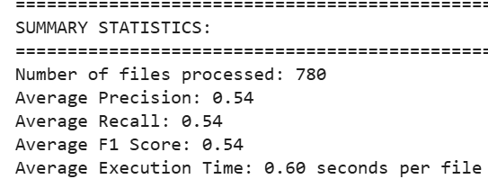
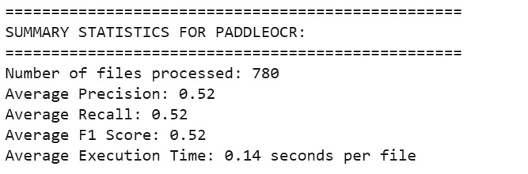
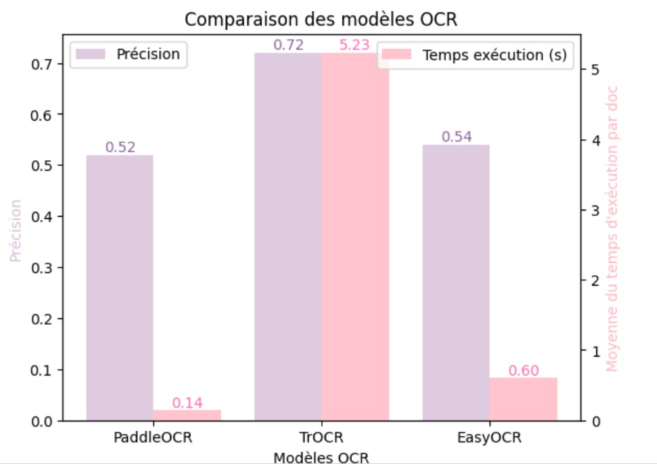

.. role:: red
   :class: red

.. role:: green
   :class: green

.. role:: blue
   :class: blue

.. role:: orange
   :class: orange

.. raw:: html

   

Benchmark OCR 
===================

Introduction
-----------

Dans le domaine médical, l'exactitude des données est primordiale. C'est dans cette optique que nous avons réalisé un benchmark approfondi de trois systèmes OCR sur nos analyses sanguines. Notre objectif était simple : déterminer quel système de reconnaissance de caractères offre la meilleure fiabilité pour la numérisation des résultats d'analyses médicales.

`Notebook Jupyter </Documentation/notebooks/benchmark__ocripynb.ipynb>`_

Résultats de notre étude
------------------------

`TROCR `
~~~~~~~~

TROCR se révèle être le système le plus précis de notre benchmark. Sur nos 300 prescriptions, il atteint une :green:`précision de 72%` et un temps de traitement de :blue:`5.23 secondes` par image. Son F1 Score de :green:`0,72` confirme sa constance dans le traitement de nos documents médicaux.

.. code-block:: python
    :emphasize-lines: 1,2

    from doctr.io import DocumentFile
    from doctr.models import ocr_predictor

    model = ocr_predictor(pretrained=True)
    for i in range(1, 301):  # Pour nos 20 analyses
        image_path = f"images_analyse/{i}.jpg"
        doc = DocumentFile.from_images(image_path)
        result = model(doc)

`EasyOCR `
~~~~~~~~~~

EasyOCR nous a donné :green:`54% de précision` et un F1 Score de :green:`0,54`. Son temps de traitement de :orange:`0.6 secondes`.

.. code-block:: python
    :emphasize-lines: 1

    import easyocr
    import os

    reader = easyocr.Reader(['fr'])
    image_dir = 'images_analyse'
    for img in sorted(os.listdir(image_dir)):
        result = reader.readtext(os.path.join(image_dir, img))

`PaddleOCR`
~~~~~~~~~~~~~~~~~~~~~~~~~~~~~~~~~~~~~~~~~~~~~~~~~~~~~

Sur nos analyses sanguines, PaddleOCR se montre décevant avec une :red:`précision de seulement 52%` et un F1 Score de :red:`0,52`, malgré sa rapidité de :green:`0.14 secondes` par image.

.. code-block:: python
    :emphasize-lines: 1

    from paddleocr import PaddleOCR
    import glob

    ocr = PaddleOCR(use_angle_cls=True, lang='fr')
    for img_path in glob.glob('images_analyse/*.jpg'):
        result = ocr.ocr(img_path)

Résumé des résultats
--------------------

Nos résultats sur ces 300 préscriptions médicales se résument comme suit :
- :green:`TROCR` : 72% de précision, 5.23 secondes par image, F1 Score de 0.72
- :green:`EasyOCR` : 54% de précision, 0.6 secondes par image, F1 Score de 0.54
- :red:`PaddleOCR` : 52% de précision, 0.14 secondes par image, F1 Score de 0.52

Configuration matérielle
----------------------

Pour nos tests, nous avons utilisé une configuration robuste qui s'est révélée nécessaire pour des performances optimales :

- RAM : :blue:`16 GB minimum`
- GPU : :blue:`Carte graphique dédiée requise`
- OS : Linux/Windows/MacOS
