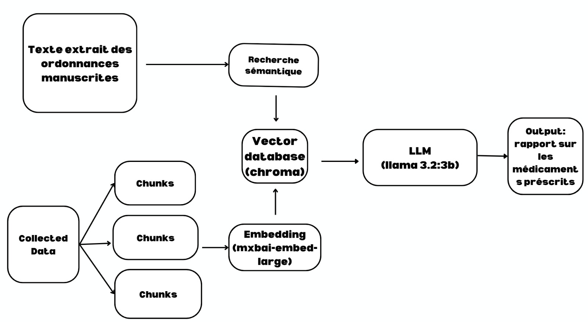

Technique de RAG pour la Génération du Rapport de l'Analyse des Ordonnances
===========================================================================

Introduction
------------
On a choisi d'utiliser la technique RAG (Retrieval-Augmented Generation) pour générer le rapport de l'analyse des ordonnances. Ce module de notre système d'analyse d'ordonnances combine la puissance des modèles de langage avec une base de connaissances structurée pour fournir des analyses précises et contextualisées des prescriptions médicales.

Pipeline du RAG et du Traitement des Ordonnances
------------------------------------------------

    Architecture complète du système RAG pour le traitement des ordonnances

1. Module de RAG
~~~~~~~~~~~~~~~~

Composants principaux :

.. list-table::
   :widths: 30 70
   :header-rows: 0

   * - **Base de connaissance**
     - ChromaDB (base vectorielle)
   * - **Modèle d'Embedding**
     - Ollama mxbai-embed-large
   * - **Modèle de Langage**
     - Llama3-3b
   * - **Système de prompting**
     - Personnalisé pour:
       - Correction automatique des sorties OCR (ex: "20o mg" → "200 mg")
       - Correction des noms de médicaments via un dictionnaire spécialisé

Fonctionnement Avancé
---------------------

Corrections Automatiques
^^^^^^^^^^^^^^^^^^^^^^^^
Exemples de transformations automatiques :
   "pdt"       → "pendant"
   "20o mg"    → "200 mg" 
   "Amoxcillin" → "Amoxcilline" (via dictionnaire médical)

.. note::
   Le système utilise un dictionnaire pharmaceutique complet pour valider et corriger les noms de médicaments mal orthographiés dans les ordonnances.

